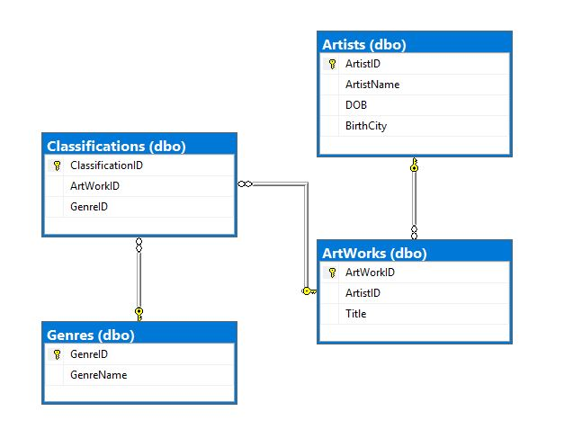
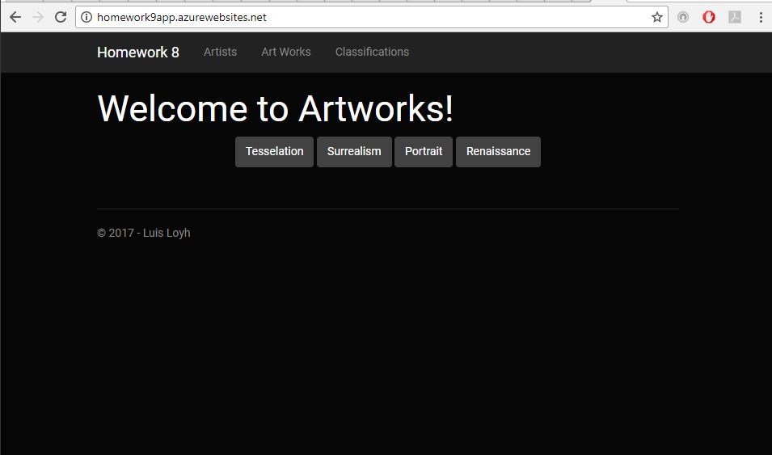

<div style="overflow: hidden; background-color: #333; color: white; width: 50px; padding: 0.5em; text-align: center" onclick="window.location='https://lloyh.github.io/home';">Home</div>

# Homework 8: An MVC web application that uses a multi-table, relational database instance

The assignment instructions can be accessed [here.](http://www.wou.edu/~morses/classes/cs46x/assignments/HW8.html)

The MVC project code I wrote for this homework can be accessed under the following folder in my main portfolio repository for this assignment: [Homework 8]( https://github.com/lloyh/lloyh.github.io/tree/master/CS460/HW8)

Live website located [here](http://homework9app.azurewebsites.net).


### Requirement 1
Has script(s) to create, populate and delete the
database

up.sql script:
```sql
CREATE TABLE Artists
(		
	ArtistID	INT IDENTITY(1,1) NOT NULL,
	ArtistName	NVARCHAR(50) NOT NULL,
	DOB			DATE NOT NULL,
	BirthCity	NVARCHAR(100),
	CONSTRAINT	[PK_dbo.Artists] PRIMARY KEY CLUSTERED (ArtistID ASC)
);

CREATE TABLE ArtWorks
(
	ArtWorkID	INT IDENTITY (1,1) NOT NULL,
	ArtistID	INT NOT NULL,
	Title		NVARCHAR(100) NOT NULL,
	CONSTRAINT [PK.dbo.ArtWorks] PRIMARY KEY CLUSTERED (ArtWorkID ASC),
	CONSTRAINT [FK_dbo.ArtWorks_Artists] FOREIGN KEY (ArtistID) REFERENCES dbo.Artists(ArtistID)
);

CREATE TABLE Genres
(
	GenreID		INT IDENTITY (1,1) NOT NULL,
	GenreName	NVARCHAR(100) NOT NULL,
	CONSTRAINT [PK_dbo.Genres] PRIMARY KEY CLUSTERED (GenreID ASC)
);

CREATE TABLE Classifications
(
	ClassificationID	INT IDENTITY (1,1) NOT NULL,
	ArtWorkID			INT NOT NULL,
	GenreID				INT NOT NULL,
	CONSTRAINT [PK_dbo.Classifications] PRIMARY KEY CLUSTERED (ClassificationID ASC),
	CONSTRAINT [FK_dbo.ArtWorks_Classifications] FOREIGN KEY (ArtWorkID) REFERENCES dbo.ArtWorks(ArtWorkID),
	CONSTRAINT [FK_dbo.Genre_Classifications] FOREIGN KEY (GenreID) REFERENCES dbo.Genres(GenreID)
);

INSERT INTO dbo.Artists
(
	ArtistName,
	DOB,
	BirthCity
)
VALUES
	('MC Escher','06/17/1898', 'Leeuwarden, Netherlands' ),
	('Leonardo Da Vinci', '05/02/1519', 'Vinci, Italy'),
	('Hatip Mehmed Efendi','11/18/1680','Unknown'),
	('Salvador Dali','05/11/1904','Figueres, Spain');

INSERT INTO dbo.Genres
(
    GenreName
)
VALUES
	('Tesselation'),
	('Surrealism'),
	('Portrait'),
	('Renaissance');

INSERT INTO dbo.ArtWorks
(
	Title,
	ArtistID
)
VALUES
	('Circle Limit III', '1'),
	('Twon Tree', '1'),
	('Mona Lisa', '2'),
	('The Vitruvian Man','2'),
	('Ebru','3'),
	('Honey Is Sweeter Than Blood','4');

INSERT INTO dbo.Classifications
(
    ArtWorkID,
    GenreID
)
VALUES
	( '1', '1' ),
	( '2', '1' ),
	( '2', '2' ),
	( '3', '3' ),
	( '3', '4' ),
	( '4', '4' ),
	( '5', '4' ),
	( '6', '2' );
GO
```

down.sql script:
```sql
DROP TABLE Classifications;
GO
DROP TABLE ArtWorks;
GO
DROP TABLE Artists;
GO
DROP TABLE Genres;
```

### Requirement 2
Tables for Artists, ArtWorks, Genres and
Classifications are correct; have appropriate
names, types, relations/constraints

This is the ER Diagram of the database relationship



### Requirement 3 
Db is populated with given seed data
Main page has a menu or links to entities list
pages; list pages show all entities
Has CRUD functionality for Artists; all parts
work as expected



### Requirement 4
Artist Edit page does not allow long names, all
attributes are required and no future birthdates
Has Genres buttons that work, shows works and
artists, sorted correctly

Artist Name limited to 50 characters:
```csharp
		[Required]
        [StringLength(50)]
        [Display(Name ="Artist Name")]
        public string ArtistName { get; set; }
```

<iframe width="560" height="315" src="https://www.youtube.com/embed/rLU1IebIbh8?rel=0&amp;controls=0&amp;showinfo=0&amp;autoplay=1&amp;loop=1&amp;playlist=rLU1IebIbh8" frameborder="0" gesture="media" allowfullscreen></iframe>

### Requirement 5
Genres feature uses AJAX

```js
function retrieveGenre(id) {
    $.ajax({
        type: "GET",
        url: "/Home/Genre/" + id,
        dataType: "json",
        success: function (data) { display(data); },
        error: function (data) { alert("Error getting JSon result! Try submitting data again"); }
    });
}

function display(data) {
    $("#artworkOutput").empty();
    var string = "<table class='table table-striped table-hover'>"
        + "<thead><th class='text-center'>Artwork"
        + "</th><th class='text-center'>Artist</th></thead>"
        + "<tbody>";
    $.each(data, function (i, item) {
        string = string
            + "<tr><td>"
            + item["Artwork"]
            + "</td><td>"
            + item["Artist"]
            + "</td></tr>";
    });
    string += "</tbody></table>"
    $("#artworkOutput").append(string);
}
```


```csharp
public JsonResult Genre(int id)
        {            
            List<ArtWorkData> list = new List<ArtWorkData>();            
            var artList = db.Genres.Where(g => g.GenreID == id)
                .Select(s => s.Classifications)
                .FirstOrDefault()
                .Select(x => new { x.ArtWork.Title, x.ArtWork.Artist.ArtistName })
                .OrderBy(o => o.Title)
                .ToList();            
            foreach (var v in artList)
            {                
                ArtWorkData piece = new ArtWorkData();                
                piece.Artist = v.ArtistName;
                piece.Artwork = v.Title;                
                list.Add(piece);
            }
            return Json(list, JsonRequestBehavior.AllowGet);
        }
```

### Requirement 6
Uses Git; all work done in a feature branch and
merged into master when finished

Used branch named "hmw8" and merged into master with:

```bash
git checkout master
git merge hmw8 -m "merge homework 8"
git push origin master
```

### Video of the Application

<iframe width="560" height="315" src="https://www.youtube.com/embed/rLU1IebIbh8?rel=0&amp;controls=0&amp;showinfo=0&amp;autoplay=1&amp;loop=1&amp;playlist=rLU1IebIbh8" frameborder="0" gesture="media" allowfullscreen></iframe>