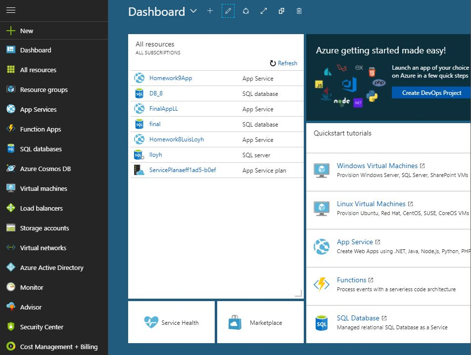
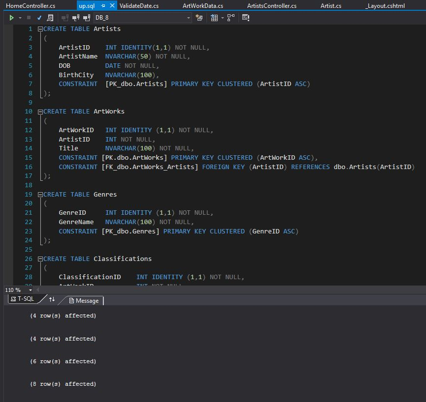
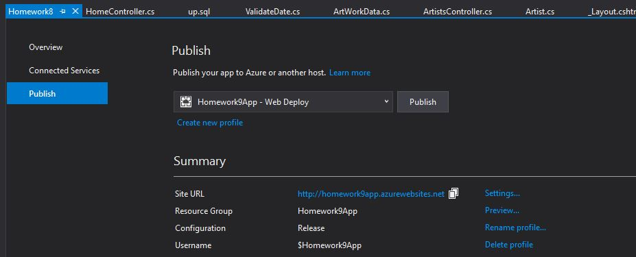
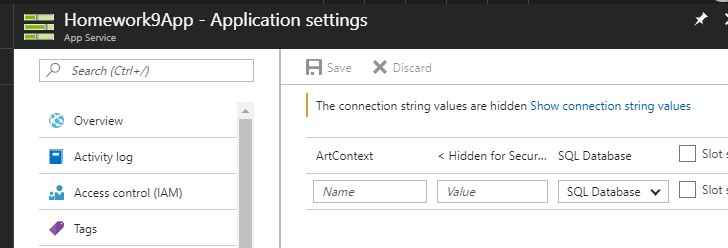
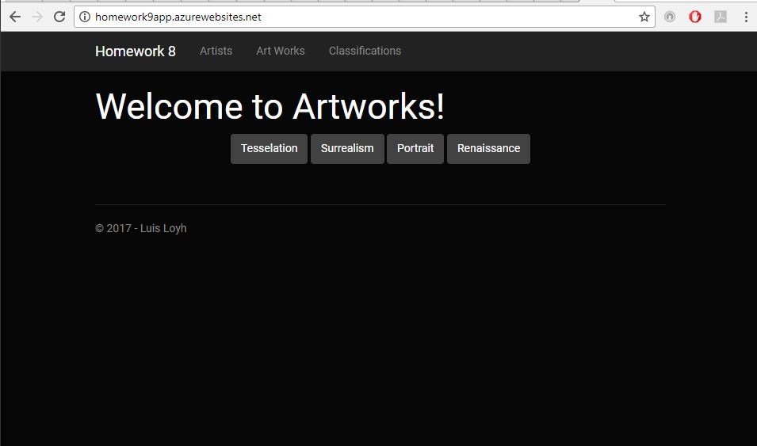

Home

# Homework 9: An MVC web application and its Database deployed to the cloud

For this assignment we were tasked with publishing a web application that uses a relational database we created via an SQL scrip to a hosting service on the Internet. We used Microsoft Azure for the hosting portion of the application and the corresponding database. The project is directly derived from Homework 8.

Live website located [here](http://homework9app.azurewebsites.net).

The assignment instructions can be accessed [here.](http://www.wou.edu/~morses/classes/cs46x/assignments/HW9.html)

The MVC project code I wrote for this homework can be accessed under the following folder in my main portfolio repository: [Homework 8]( https://github.com/lloyh/lloyh.github.io/tree/master/CS460/HW8)

### Step 1: Setting up an Azure account, SQL Server and Database and an App Service

I first created an account on Microsoft Azure at https://azure.microsoft.com/ and created an SQL Server (lloyh), an SQL Database (DB_8) and an App Service (Homework9App).

### Step 2: Running the up.sql script to the Azure SQL Database

In Visual Studio, I connected to the Azure database and ran the up.sql script.

### Step 3: Push content to web server using WebDeploy

I then published the application via Visual Studio.

After publishing the application, I went to my Azure Web application “Homework9App,” selected Application settings and entered the connection string for the Azure database I created earlier and the context name context name.

### Video of the Application

<iframe width="560" height="315" src="https://www.youtube.com/embed/rLU1IebIbh8?rel=0&amp;controls=0&amp;showinfo=0&amp;autoplay=1&amp;loop=1&amp;playlist=rLU1IebIbh8" frameborder="0" gesture="media" allowfullscreen></iframe>